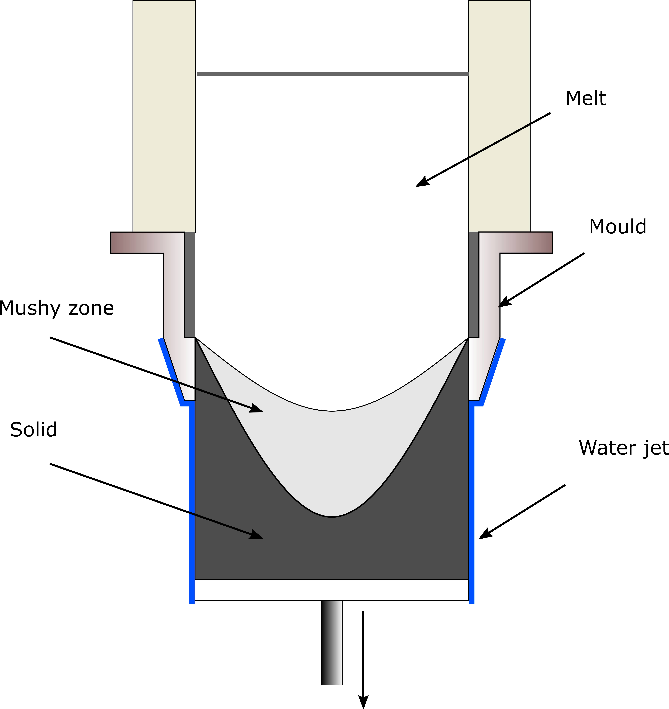

# Summary

Direct-chill (DC) casting is a semi-continuous casting process that is used for producing aluminium and magnesium alloy billets [@Eskin2008]. As illustrated in (\autoref{fig:DC_Sketch}), the process consists of feeding melt (liquid metal) into a mould containing a movable bottom (the ram). The ram is lowered and the billet is pulled downwards by gravity. As the billet exists the mould, its exposed outer surface is chilled with water jets to hasten cooling (hence the term direct-chill).

{ width=60% }

After DC casting, the billets are subject to further energy intensive processing (e.g. extrusion, rolling, forging ...). If billets contain defects or are of poor quality, they are either rejected or will ultimately result in components of poor quality: this makes DC casting a crucial step in alloy processing. In a push for lower carbon emissions and greater recyclability of metallic components, DC casting is currently the subject of various optimization studies involving the presence of external fields. These studies include:  

1. the use of ultrasound [@Eskin2014; @Lebon2019a; @Lebon2019b; @Subroto2021; @Yamamoto2021].
2. high-shear melt conditioning with a rotor-stator mixer [@Xia2013; @PrasadaRao2014; @Li2017; @Lebon2018; @Lebon2020; @Sree2021], and 
3. electromagnetic fields [@Hatic2018].

All these studies benefit from numerical modeling to cut down on the number of experiments that are required to study the process.
 
# Statement of need

`directChillFoam` is an OpenFOAM solver [@OpenFOAM] for the computational fluid dynamics (CFD) modelling of the DC casting process. `directChillFoam` extended OpenFOAM's `buoyantPimpleFoam` solver to include the following functionalities:  

* An improved solidification model that can handle alloys with more than two components and with a liquid fraction-temperature profile that can be entered with an interpolation table. These enable the use of thermophysical properties that can be calculated on the fly by a CALPHAD package e.g. [@Andersson2002].
* Switching between mushy and slurry zones in the phase transition region to accurately handle the flow near the solidification front.
* Treatment of the secondary cooling heat transfer boundary condition.
* An energy corrector loop to correctly update the phase fraction while conserving energy, based on the approach of [@Faden2018].
* A solute model library to model macrosegregation and a corresponding solver for the solute transport equations.

`directChillFoam` makes the most of OpenFOAM's modularity and implements each significant functionality within reusable libraries. The power of `directChillFoam` lies within the ease with which the solver can be extended. For example, `directChillFoam` has been coupled with a novel acoustic streaming solver [@acousticStreamingFoam] to model acoustic streaming inside a direct-chill casting mould [@Lebon2019b]. Such coupling of a newly published complex numerical method would be non-trivial in a commercial CFD software package.

`directChillFoam` was designed to be used by both academics involved in fundamental casting research and industry practitioners for optimization problems. It has already been used in a number of scientific publications involving melt-conditioned direct-chill (MC-DC) casting [@Lebon2018; @Lebon2020;] and ultrasonic processing [@Lebon2019a; @Lebon2019b; @Subroto2021]. It has also been presented in introductory modeling doctoral courses that are provided by the Liquid Metal Engineering training centre at Brunel University.

# Availability
`directChillFoam` is available on [Github](https://github.com/blebon/directChillFoam). [Documentation](https://github.com/blebon/directChillFoam/tree/master/docs) is provided for a description of its functionality and included libraries. A [tutorial case](https://github.com/blebon/directChillFoam/tree/master/tutorials/heatTransfer/directChillFoam/Vreeman2002) including code validation using experimental data is also available.

# Acknowledgements

Financial support from the Engineering and Physical Sciences Research Council (EPSRC), UK, under Grant Number EP/N007638/1, is gratefully acknowledged. We are grateful to the UK Materials and Molecular Modelling Hub for computational resources, which is partially funded by EPSRC (EP/P020194/1 and EP/T022213/1).

# References
